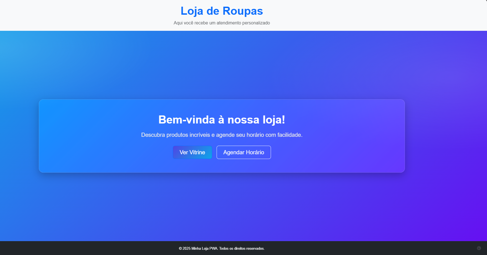
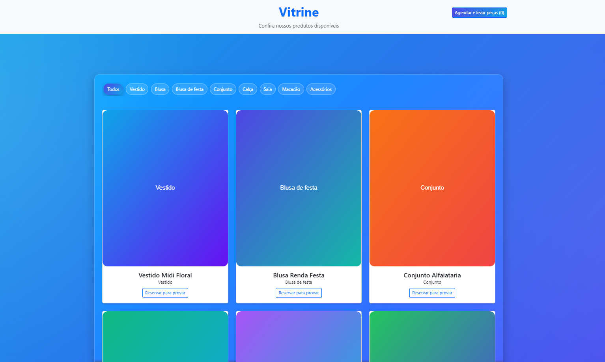
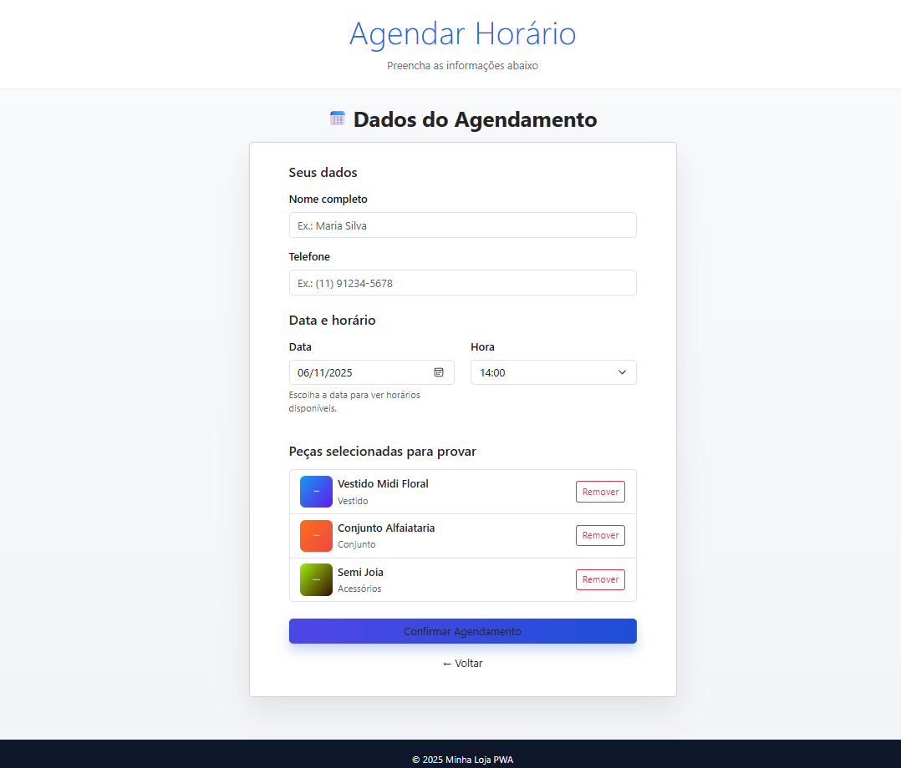
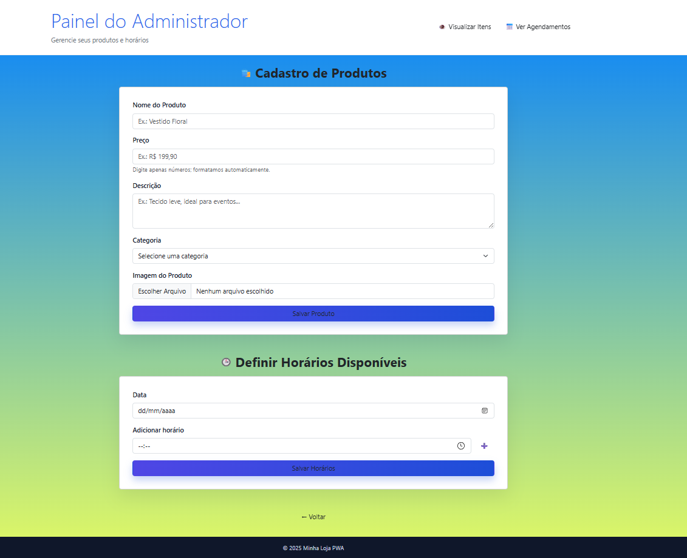
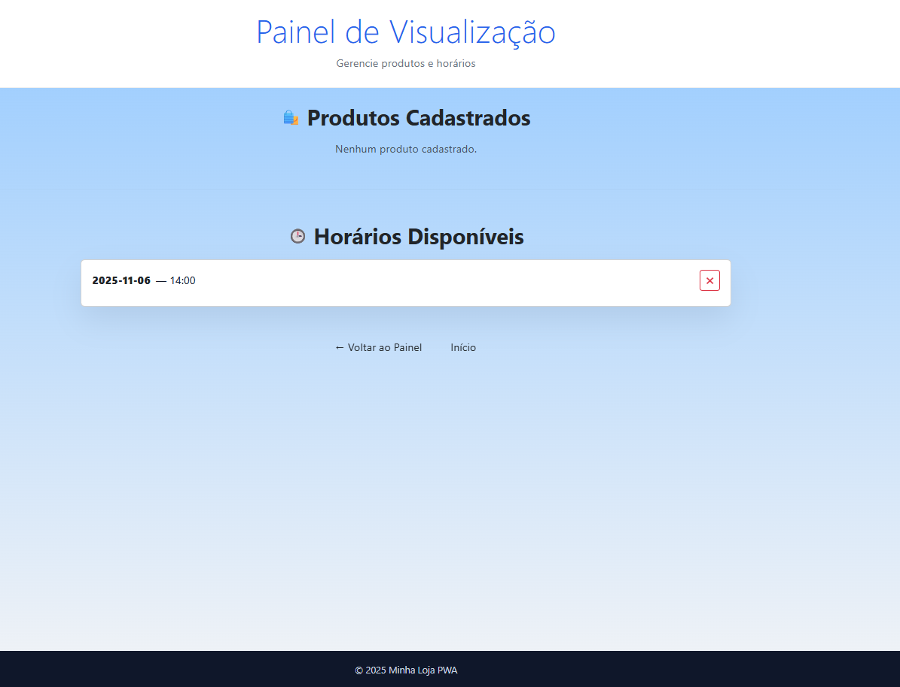
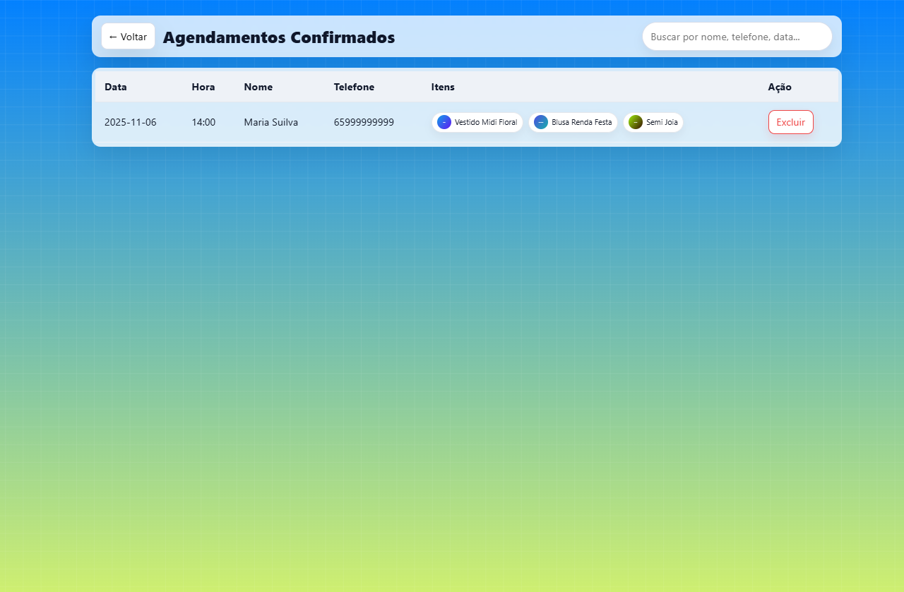

  

✨ PodeMarcar! — PWA de Agendamento VIP

Aplicativo PWA desenvolvido no Projeto Extensionista Integrador IV — UNIVAG, orientado pelo Prof. Esp. Walderson Shimokawa.
O PodeMarcar! oferece agendamento exclusivo para clientes VIP de lojas de moda, com seleção prévia de peças, vitrine digital e histórico de atendimentos para apoiar a decisão da lojista.

🚀 Objetivo

Entregar um MVP leve, acessível e instalável (PWA) que permita às lojas gerenciar atendimentos personalizados e agilizar o fluxo de prova de peças, integrando:

Agendamento inteligente com confirmação

Seleção prévia de itens pela cliente

Vitrine com filtros simples (estilos)

Notificações e integração com Google Agenda

🧩 Funcionalidades

🗓️ Agendamento VIP: escolha de data/horário com disponibilidade básica

👗 Vitrine: catálogo simples com filtros por estilo (ex.: vestidos, blusas, festa)

⭐ Pré-seleção de Peças: cliente marca o que deseja experimentar

📒 Histórico de Atendimentos: visão rápida para a lojista

🔔 Notificações Push (MVP): via Firebase Cloud Messaging (ou OneSignal)

📆 Google Calendar: criação de evento com título e descrição pré-moldados

💬 Canal de Confirmação: mensagem de WhatsApp/SMS (link rápido)

📲 PWA: instalação no celular/desktop, offline básico e ícone na home

🖼️ Telas 

|          Home             |          Vitrine               |          Agendar Horario               |          Painel do ADM           | |          Painel de Cadastro                | |  Painel de Agendamentos concluídos  | 
| :------------------------:| :-----------------------------:| :-------------------------------------:| :------------------------------: | | :----------------------------------------: | | :---------------------------------: | 
|  |  |  |  | |  | |  |
	
	
	

Substitua as imagens acima por capturas reais em ./design/.

🗂️ Estrutura de Pastas
PODER_MARCAR/
│
├── .config/
├── node_modules/
├── public/
├── src/
│   ├── components/
│   │   └── pages/
│   │       ├── Admin.tsx
│   │       ├── AdminAgendamentos.tsx
│   │       ├── AdminListar.tsx
│   │       ├── Agendar.tsx
│   │       ├── Confirmacao.tsx
│   │       ├── Home.tsx
│   │       └── Vitrine.tsx
│   ├── styles/
│   │   ├── Admin.css
│   │   ├── AdminAgendamentos.css
│   │   ├── AdminListar.css
│   │   ├── Agendar.css
│   │   ├── Confirmacao.css
│   │   ├── Home.css
│   │   ├── theme.css
│   │   └── Vitrine.css
│   ├── utils/
│   │   ├── calendarLinks.ts
│   │   ├── sacola.ts
│   │   └── whatsapp.ts
│   ├── App.css
│   ├── App.tsx
│   ├── firebaseConfig.ts
│   └── index.tsx
├── .gitignore
├── .replit
├── index.html
├── package-lock.json
├── package.json
├── README.md
├── tsconfig.json
├── tsconfig.node.json
└── vite.config.ts

⚙️ Instalação e Execução
# Clone o repositório
git clone https://github.com/seu-usuario/podemarcar.git
cd podemarcar

# Instale as dependências
npm install

# Execute em desenvolvimento
npm run dev

# Build de produção
npm run build
npm run preview

🔐 Variáveis de Ambiente

Crie um arquivo .env (ou .env.local) na raiz com base no modelo .env.example:

VITE_FIREBASE_API_KEY=...
VITE_FIREBASE_AUTH_DOMAIN=...
VITE_FIREBASE_PROJECT_ID=...
VITE_FIREBASE_STORAGE_BUCKET=...
VITE_FIREBASE_MESSAGING_SENDER_ID=...
VITE_FIREBASE_APP_ID=...

# Opcional (notificações)
VITE_ONESIGNAL_APP_ID=...

As chaves públicas do Firebase podem ficar no cliente (são config), mas regras do Firestore devem proteger leitura/escrita.

🔗 Integrações

Firestore (Firebase): armazenamento de agendamentos, seleção de peças e histórico

FCM / OneSignal: envio de notificações push (MVP)

Google Calendar: criação de evento com título/descrição padrão, ex.

Resumo: Atendimento VIP — {nome da cliente}

Descrição: Peças selecionadas: ... | Observações: ...

Local: Loja X

Convidado (opcional): e-mail da cliente

🛠️ Tecnologias

React + Vite (Frontend PWA)

TypeScript

Firebase (Firestore, Auth, Storage, FCM)

CSS Modules / CSS puro (MVP)

Service Worker + Manifest (PWA)

👣 Fluxo (alto nível)

Cliente acessa o link do PodeMarcar!

Navega na Vitrine, filtra por estilo e pré-seleciona peças

Abre Agendar, escolhe data/horário e confirma

App cria registro no Firestore e (opcional) evento no Google Calendar

Lojista visualiza os próximos atendimentos e o histórico

🗺️ Roadmap (MVP → +)

 Vitrine com filtros por estilo

 Agendamento básico e armazenamento no Firestore

 Descrição pré-moldada no Google Calendar

 Notificações push (confirmação/lembrança)

 Painel simples para a lojista (lista + histórico)

 Regras de segurança do Firestore (produção)

👩‍💻 Equipe
Nome	Função
Erik August Benevides	-> Frontend / Integrações / Documentação
João Gabriel ->	UI/UX / Frontend
Gabriel Beretta ->	Suporte 
Guilherme Sanches Martins	-> Dev Backend 
Renato Pinheiro ->	Apoio

🏫 Disciplina

Projeto Extensionista Integrador IV — UNIVAG

⚠️ Observações

Projeto com fins educacionais; dados podem ser mockados no MVP

A integração com notificações e Calendar pode variar conforme credenciais/conta
